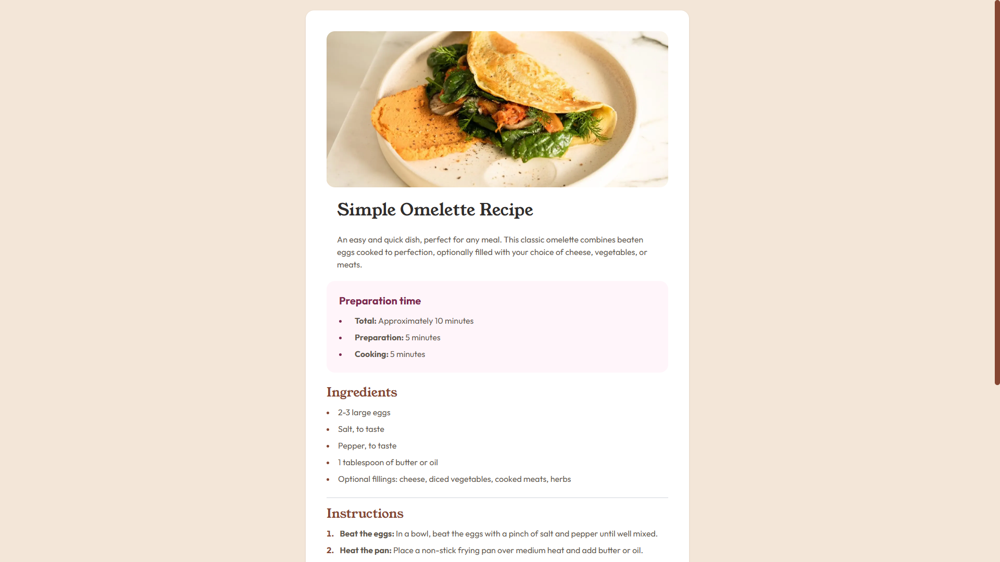

# Frontend Mentor - Recipe page solution

This is a solution to the [Recipe page challenge on Frontend Mentor](https://www.frontendmentor.io/challenges/recipe-page-KiTsR8QQKm). Frontend Mentor challenges help you improve your coding skills by building realistic projects. 

## Table of contents

- [Overview](#overview)
  - [The challenge](#the-challenge)
  - [Screenshot](#screenshot)
  - [Links](#links)
- [My process](#my-process)
  - [Built with](#built-with)
- [Author](#author)

## Overview

### Screenshot

### Links

- Solution URL: [Github](https://github.com/luizvidal-frontendmentor/001-recipe-page-main)
- Live Site URL: [Recipe Page Main](https://frontendmentor-001-recipe-page-main.vercel.app)

## My process

### Built with

- TailwindCSS
- [Next.js](https://nextjs.org/) - React framework

## Author

- Website - [Luiz Vidal](https://www.luizvidal.com)
- Frontend Mentor - [@luizvidal](https://www.frontendmentor.io/profile/luizvidal)

